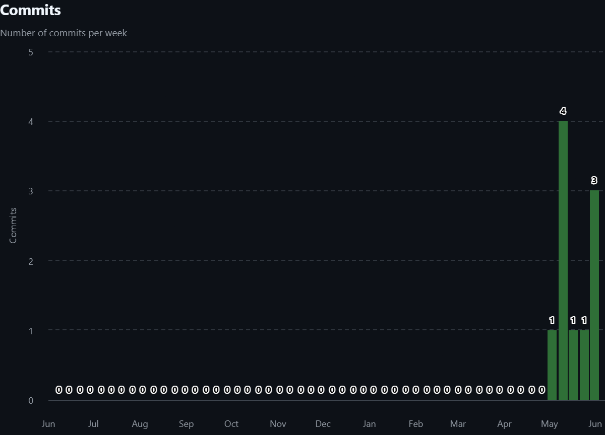

# Calculator

**Конфигурируемый калькулятор для автоматизации ценообразования малого бизнеса**

Веб-приложение, которое позволяет гибко настраивать ценообразование через справочник материалов и формулы с плейсхолдерами. Итоговая стоимость пересчитывается при каждом открытии расчёта — всегда актуальные цены без ручного обновления.

---

## Стек и архитектура

| Компонент | Технология |
|---|---|
| Архитектура | PCMEF (Presentation / Control / Mediator / Entity / Foundation) |
| Бэкенд | Java 25, Spring Boot 4.0.6, Spring Security + JWT |
| Веб-клиент | React + TypeScript |
| Десктоп-клиент | JavaFX 21 |
| База данных | PostgreSQL 16 |
| Контейнеризация | Docker + docker-compose |
| API | REST, версионирование `/api/v1/`, Swagger UI |

---

## Быстрый старт

```bash
# 1. Скопировать SQL-скрипты
cp docs/04-database/ddl.sql      src/ddl.sql
cp docs/04-database/triggers.sql src/triggers.sql

# 2. Создать src/.env
echo "JWT_SECRET=замените-на-секрет-минимум-32-символа" > src/.env

# 3. Запустить
cd src && docker compose up --build -d
```

После запуска:
- Веб-клиент: http://localhost:80
- Swagger UI: http://localhost:8080/api/v1/swagger-ui/index.html
- Логин: `admin` / `admin`

Подробнее — [docs/08-final/admin-guide.md](docs/08-final/admin-guide.md).

---

## Структура репозитория

```
src/
├── CalculatorBack/     # Spring Boot бэкенд
├── CalculatorWeb/      # React фронтенд
├── CalculatorDesktop/  # JavaFX десктоп-клиент
├── docker-compose.yml
docs/
├── 01-business-model/  # Этап 0: Бизнес-анализ
├── 02-requirements/    # Этап 1: Требования
├── 03-architecture/    # Этап 2: Архитектура
├── 04-database/        # Этап 3: База данных
├── 05-design/          # Этап 4: Детальное проектирование
├── 06-implementation/  # Этап 5-6: Реализация и рефакторинг
├── 07-ui/              # Этап 7: Интерфейс
└── 08-final/           # Этап 8: Завершение (ТЗ, руководства)
```

---

## Статистика разработки

### Метрики Git

- **Всего коммитов:** 12
- **Период разработки:** 09.05.2026 — 01.06.2026
- **Ветка:** `master`

### График активности коммитов


