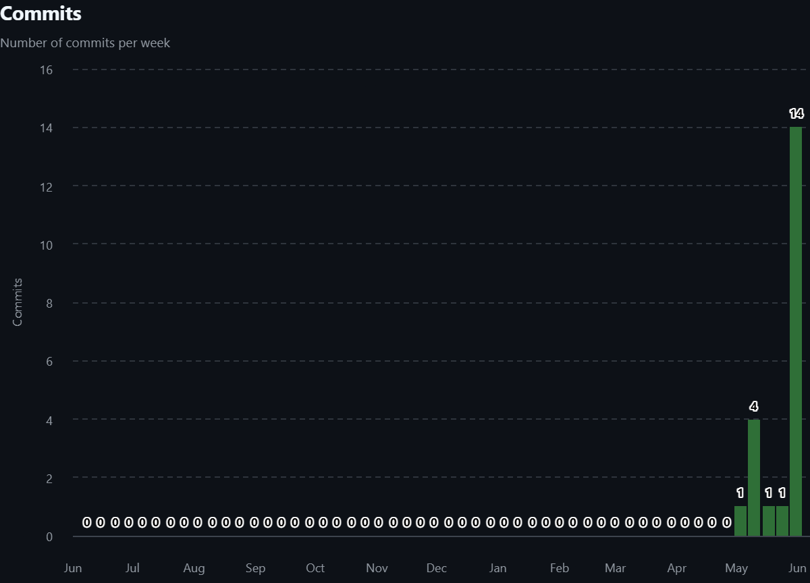

# Calculator

**Конфигурируемый калькулятор для автоматизации ценообразования малого бизнеса**

**Автор:** Шевченко Денис
**Траектория:** Г — Enterprise (Desktop + Web + REST API + Docker + CI/CD)

Веб-приложение, которое позволяет гибко настраивать ценообразование через справочник материалов и формулы с плейсхолдерами. Итоговая стоимость пересчитывается при каждом открытии расчёта — всегда актуальные цены без ручного обновления.

Траектория:
**Enterprise** (Desktop + Web + REST API + Docker + CI/CD)


---

## Стек и архитектура

| Компонент | Технология |
|---|---|
| Архитектура | PCMEF (Presentation / Control / Mediator / Entity / Foundation) |
| Бэкенд | Java 25, Spring Boot 4.0.6, Spring Security + JWT |
| Веб-клиент | React + TypeScript |
| Десктоп-клиент | JavaFX 21 |
| База данных | PostgreSQL 16 |
| Контейнеризация | Docker + docker-compose |
| API | REST, версионирование `/api/v1/`, Swagger UI |
| Безопасность | JWT (access + refresh), BCrypt, 17 прав доступа |
| Сборка | Gradle, Vite |
| Инструменты | Git, Postman, JaCoCo, Checkstyle |

---

## Требования к окружению

| Требование | Версия |
|---|---|
| Java JDK | 25 |
| Node.js | 18+ |
| PostgreSQL | 16+ |
| Docker | 20+ |
| Docker Compose | 2+ |

---

## Быстрый старт

```bash
# 1. Скопировать SQL-скрипты
cp docs/04-database/ddl.sql      src/ddl.sql
cp docs/04-database/triggers.sql src/triggers.sql
cp docs/04-database/seed.sql     src/seed.sql

# 2. Создать src/.env
echo "JWT_SECRET=замените-на-секрет-минимум-32-символа" > src/.env

# 3. Запустить
cd src && docker compose up --build -d
```

После запуска:
- Веб-клиент: http://localhost:80
- Swagger UI: http://localhost:8080/api/v1/swagger-ui/index.html
- Логин: `admin` / `admin`

Подробнее — [docs/10-deployment/admin-guide.md](docs/10-deployment/admin-guide.md).

---

## Ключевые API-эндпоинты

Базовый URL: `http://localhost:8080/api/v1`

| Метод | Эндпоинт | Описание | Доступ |
|---|---|---|---|
| POST | /auth/login | Вход в систему | Публичный |
| POST | /auth/refresh | Обновление токена | Публичный |
| GET | /materials | Список материалов (пагинация, фильтр) | USER+ |
| POST | /materials | Создать материал | ADMIN |
| PUT | /materials/{id} | Изменить материал | ADMIN |
| DELETE | /materials/{id} | Удалить материал | ADMIN |
| GET | /formulas | Список формул | USER+ |
| POST | /calculations | Создать расчёт | USER+ |
| GET | /users | Список пользователей | ADMIN |
| GET | /roles | Список ролей | ADMIN |

Полная документация: [Swagger UI](http://localhost:8080/api/v1/swagger-ui/index.html) · [Postman коллекция](docs/09-api/postman-collection.json)

---

## Структура репозитория

```
src/
├── CalculatorBack/     # Spring Boot бэкенд
├── CalculatorWeb/      # React фронтенд
├── CalculatorDesktop/  # JavaFX десктоп-клиент
└── docker-compose.yml

docs/
├── 00-project-charter/  # Паспорт проекта, IDEF0, BUC, SWOT, глоссарий
├── 01-requirements/     # Требования: Use Case, Domain Model, трассировка
├── 02-architecture/     # Архитектура: PCMEF, ADR, интерфейсы
├── 03-database/         # БД: ER-диаграмма, DDL, триггеры
├── 04-detailed-design/  # Проектирование: диаграммы классов, sequence
├── 05-implementation/   # Реализация: структура кода, CI/CD, статанализ
├── 06-testing/          # Тестирование: JUnit, JaCoCo, Postman
├── 07-refactoring/      # Рефакторинг: Data Mapper, Identity Map
├── 08-ui/               # Интерфейс: скриншоты веб и десктоп клиентов
├── 09-api/              # API: Swagger, Postman коллекция
├── 10-deployment/       # Развёртывание: Docker, CI/CD, администрирование
├── 11-user-guide/       # Руководство пользователя
└── 12-final-report/     # Пояснительная записка, ТЗ, WBS, Ганта, COCOMO
```

---

## Статистика разработки

### Git-метрики

| Метрика | Значение |
|---|---|
| Всего коммитов | 12 |
| Период разработки | 09.05.2026 — 01.06.2026 |
| Ветка | `master` |
| Покрытие тестами (JaCoCo) | 49% |
| Всего тестов | 275 (0 failures) |

### График активности коммитов



---

## Архитектура (PCMEF)

Система построена на паттерне PCMEF:

| Слой | Расположение | Ответственность |
|---|---|---|
| Presentation (P) | React / JavaFX | UI, ввод данных |
| Control (C) | Spring Boot | REST-контроллеры, валидация |
| Mediator (M) | Spring Boot | Бизнес-логика, сервисы |
| Entity (E) | Spring Boot | JPA-сущности |
| Foundation (F) | Spring Boot | Репозитории, доступ к БД |

Ключевые ADR:
- [ADR-001: Выбор архитектурного паттерна](docs/02-architecture/adr/adr-001-arch-pattern.md)
- [ADR-002: Выбор базы данных и ORM](docs/02-architecture/adr/adr-002-database-orm.md)
- [ADR-003: Стратегия аутентификации](docs/02-architecture/adr/adr-003-auth-strategy.md)

---

## Полезные ссылки

- [Swagger UI](http://localhost:8080/api/v1/swagger-ui/index.html)
- [Документация (docs/)](docs/)
- [Постман-коллекция](docs/09-api/postman-collection.json)
- [Руководство пользователя](docs/11-user-guide/user-guide.md)
- [Руководство администратора](docs/10-deployment/admin-guide.md)
