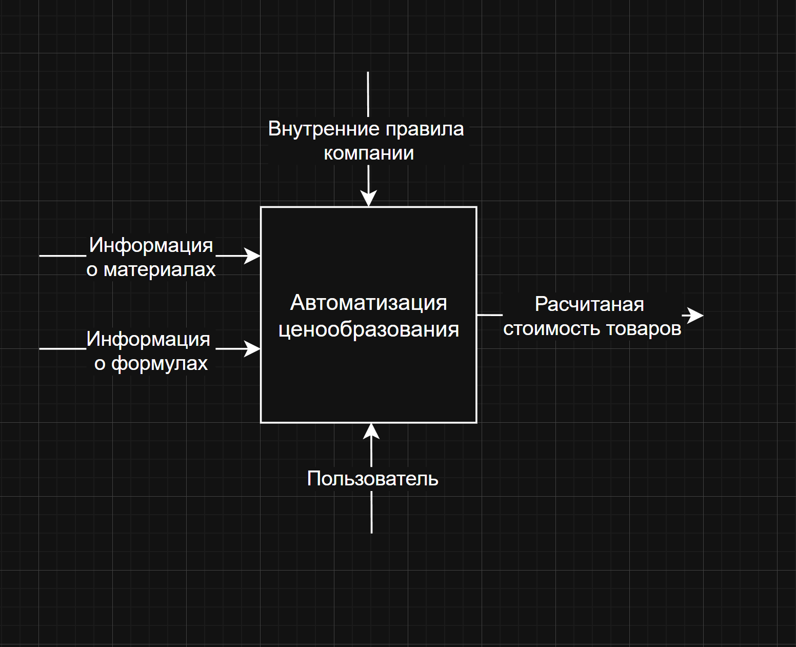

# Контекстная диаграмма (IDEF0 A-0)

## Описание

Контекстная диаграмма уровня A-0 отображает систему **Calculator** как единый функциональный блок «Автоматизировать ценообразование» и определяет её взаимодействие с внешней средой.

## Диаграмма

## Элементы диаграммы

### Входы (Input)

| Вход | Описание |
|---|---|
| Данные о материалах | Названия, цены, единицы измерения — вводятся пользователем в справочник |
| Формулы ценообразования | Математические выражения с плейсхолдерами, созданные пользователем |
| Запрос на расчёт | Выбор формулы, материалов и числовых значений для конкретного расчёта |

### Управление (Control)

| Управление | Описание |
|---|---|
| Права доступа и роли | Определяют, какие действия доступны конкретному пользователю |
| Бизнес-правила системы | Правила каскадного удаления, уникальности названий, обязательности полей |

### Механизмы (Mechanism)

| Механизм | Описание |
|---|---|
| Сервер компании-клиента | Инфраструктура, на которой развёрнут изолированный экземпляр системы |
| Веб-браузер пользователя | Клиент для взаимодействия с React-интерфейсом |
| Backend (Java 25 + Spring) | Обработка бизнес-логики, хранение и вычисление |

### Выходы (Output)

| Выход | Описание |
|---|---|
| Готовый расчёт стоимости | Вычисленная итоговая сумма по формуле с актуальными ценами материалов |
| Сохранённый расчёт | Расчёт, доступный для повторного просмотра и редактирования |
| Справочники (материалы, формулы) | Актуализированные данные, доступные для повторного использования |

## Пояснения

Система принимает от пользователей данные о ценах (материалы) и логику расчёта (формулы), а затем по запросу вычисляет итоговую стоимость продукта или услуги. Поскольку результат пересчитывается при каждом открытии расчёта, выход системы всегда отражает актуальные цены без ручного обновления.

Управляющие воздействия (роли и права) определяют, кто из сотрудников может только просматривать расчёты, а кто — создавать и редактировать материалы и формулы. Вся обработка происходит на сервере самой компании-клиента, что обеспечивает хранение данных без участия стороннего вендора.
