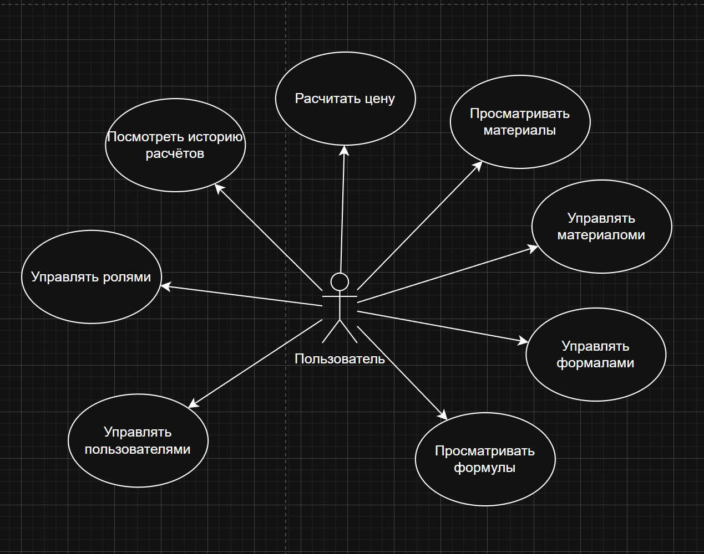

# BUC-диаграмма (Business Use Case)

## Описание

BUC-диаграмма описывает бизнес-прецеденты системы **SuperCalculator** — что система делает с точки зрения внешних участников.

## Диаграмма

## Бизнес-акторы

| Актор | Описание |
|---|---|
| Владелец бизнеса / Администратор | Настраивает систему: создаёт пользователей, роли, материалы и формулы. Имеет все права |
| Пользователь системы | Работает с расчётами в рамках назначенной роли (просмотр, создание, редактирование) |

## Бизнес-прецеденты

| ID | Название | Актор | Описание |
|---|---|---|---|
| BUC-01 | Управление справочником материалов | Администратор / Пользователь | Создание, редактирование, удаление материалов и их групп |
| BUC-02 | Управление формулами | Администратор / Пользователь | Создание и редактирование формул с плейсхолдерами |
| BUC-03 | Выполнение расчёта стоимости | Пользователь | Создание расчёта на основе формулы, заполнение позиций, получение итоговой суммы |
| BUC-04 | Просмотр сохранённых расчётов | Пользователь | Открытие ранее сохранённого расчёта с пересчётом актуальной стоимости |
| BUC-05 | Управление пользователями и ролями | Администратор | Создание пользователей, назначение ролей с наборами прав доступа |

## Описание прецедентов

### BUC-01 — Управление справочником материалов

**Актор:** Пользователь (с правом Создание/Редактирование/Удаление материалов)

**Цель:** Поддерживать актуальный справочник материалов с ценами, которые используются в расчётах.

**Основной поток:**
1. Пользователь открывает список материалов
2. Создаёт, редактирует или удаляет материал (название, цена, единица измерения, группа)
3. При необходимости управляет группами материалов

**Результат:** Справочник материалов обновлён; все расчёты, ссылающиеся на изменённые материалы, при следующем открытии отразят новые цены.

---

### BUC-02 — Управление формулами

**Актор:** Пользователь (с правом Создание/Редактирование/Удаление формул)

**Цель:** Описать логику ценообразования в виде математического выражения с плейсхолдерами.

**Основной поток:**
1. Пользователь открывает список формул
2. Создаёт или редактирует формулу: задаёт название, выражение вида `({wood} + {glue}) * {const}`, группу
3. Система валидирует синтаксис выражения

**Результат:** Формула сохранена и доступна для создания расчётов.

---

### BUC-03 — Выполнение расчёта стоимости

**Актор:** Пользователь (с правом Создание расчётов)

**Цель:** Получить итоговую стоимость конкретного продукта / услуги на основе формулы.

**Основной поток:**
1. Пользователь создаёт расчёт: задаёт название и выбирает базовую формулу
2. Для каждого плейсхолдера `{группа}` — выбирает конкретный материал из группы и указывает количество
3. Для каждого `{const}` — вводит числовое значение
4. Система вычисляет итоговую сумму

**Результат:** Расчёт сохранён с актуальной стоимостью, доступен для повторного открытия.

---

### BUC-04 — Просмотр сохранённого расчёта

**Актор:** Пользователь (с правом Просмотр расчётов)

**Цель:** Посмотреть стоимость ранее созданного расчёта с учётом текущих цен материалов.

**Основной поток:**
1. Пользователь открывает список расчётов
2. Выбирает нужный расчёт и открывает его
3. Система автоматически пересчитывает итоговую сумму по актуальным ценам

**Результат:** Пользователь видит актуальную стоимость расчёта без ручного обновления.

---

### BUC-05 — Управление пользователями и ролями

**Актор:** Пользователь (с правом на создание/редактирование/удаление ролей и пользователей)

**Цель:** Разграничить доступ сотрудников к функциям системы.

**Основной поток:**
1. Администратор создаёт роль с нужным набором прав (просмотр / создание / редактирование / удаление по каждой области)
2. Создаёт пользователя (имя, фамилия, логин, пароль) и назначает ему роль
3. При необходимости изменяет роль или удаляет пользователя

**Результат:** Пользователи имеют доступ только к разрешённым функциям системы.
