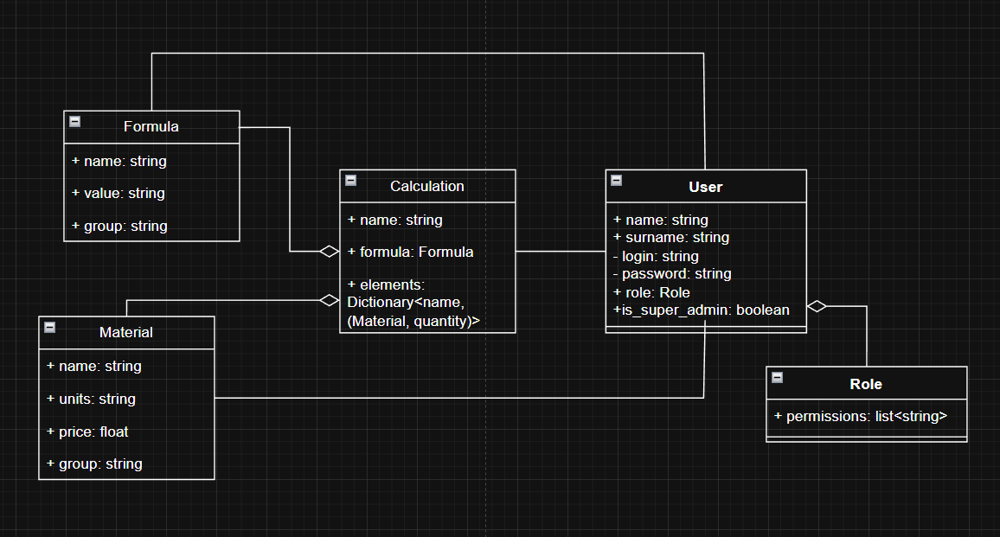

# Модель бизнес-классов

## Описание

Модель бизнес-классов описывает ключевые сущности предметной области системы **SuperCalculator** и связи между ними.

## Диаграмма

## Бизнес-классы

### MaterialGroup (Группа материалов)

**Описание:** Логическое объединение материалов для удобства навигации. При удалении группы пользователь выбирает: удалить все материалы, перенести в группу по умолчанию или в другую существующую группу.

**Атрибуты:**

| Атрибут | Тип | Описание |
|---|---|---|
| id | INTEGER | Уникальный идентификатор |
| name | VARCHAR(64) | Название группы (уникальное) |

---

### Material (Материал)

**Описание:** Справочная единица предметной области бизнеса. Система хранит материалы как справочник цен, не ведя складского учёта. Используется в формулах через плейсхолдеры.

**Атрибуты:**

| Атрибут | Тип | Описание |
|---|---|---|
| id | INTEGER | Уникальный идентификатор |
| name | VARCHAR(32) | Название материала (уникальное) |
| price | NUMERIC ≥ 0 | Цена за единицу |
| units | VARCHAR(8) | Единица измерения (необязательно) |
| group | MaterialGroup | Группа материала (FK → material_group) |

---

### FormulaGroup (Группа формул)

**Описание:** Логическое объединение формул для удобства навигации. Расчёты наследуют группу от своей базовой формулы.

**Атрибуты:**

| Атрибут | Тип | Описание |
|---|---|---|
| id | INTEGER | Уникальный идентификатор |
| name | VARCHAR(64) | Название группы (уникальное) |

---

### Formula (Формула)

**Описание:** Математическое выражение с плейсхолдерами. `{название_группы}` — при расчёте заменяется материалом из указанной группы. `{const}` — заменяется произвольным числом. Удаление формулы каскадно удаляет все расчёты на её основе.

**Атрибуты:**

| Атрибут | Тип | Описание |
|---|---|---|
| id | INTEGER | Уникальный идентификатор |
| name | VARCHAR(128) | Название формулы (уникальное) |
| expression | TEXT | Математическое выражение с плейсхолдерами |
| group | FormulaGroup | Группа формулы (FK → formula_group) |

---

### Calculation (Расчёт)

**Описание:** Формула, заполненная конкретными значениями. Итоговая стоимость пересчитывается при каждом открытии, что гарантирует актуальность. Расчёты не имеют собственных групп — навигация идёт по группам формул.

**Атрибуты:**

| Атрибут | Тип | Описание |
|---|---|---|
| id | INTEGER | Уникальный идентификатор |
| name | VARCHAR(64) | Название расчёта (уникальное) |
| formula | Formula | Базовая формула (FK → formula) |
| items | List\<CalculationItem\> | Список позиций расчёта |

---

### CalculationItem (Позиция расчёта)

**Описание:** Строка внутри расчёта, связывающая один плейсхолдер формулы с выбранным материалом и его количеством. Для плейсхолдера `{const}` роль материала выполняет числовое поле, хранимое как quantity при material_id, соответствующем константе.

**Атрибуты:**

| Атрибут | Тип | Описание |
|---|---|---|
| id | INTEGER | Уникальный идентификатор |
| position | SMALLINT | Порядковый номер позиции в расчёте |
| calculation | Calculation | Расчёт, которому принадлежит позиция |
| material | Material | Выбранный материал (FK → material, без каскадного удаления) |
| quantity | NUMERIC ≥ 0 | Количество материала |

---

### UserRole (Роль пользователя)

**Описание:** Именованный набор прав доступа. Один пользователь может иметь не более одной роли. При удалении роли у связанных пользователей роль становится NULL.

**Атрибуты:**

| Атрибут | Тип | Описание |
|---|---|---|
| id | INTEGER | Уникальный идентификатор |
| name | VARCHAR(32) | Название роли (уникальное) |

---

### Permission (Право доступа)

**Описание:** Атомарное разрешение на выполнение действия в определённой области системы. Набор прав фиксирован системой, администратор только комбинирует их при создании роли.

**Атрибуты:**

| Атрибут | Тип | Описание |
|---|---|---|
| id | INTEGER | Уникальный идентификатор |
| name | VARCHAR(64) | Название права (уникальное), напр. `MATERIAL_CREATE` |

---

### User (Пользователь)

**Описание:** Субъект системы. Супер-администратор создаётся при инициализации системы, не может быть удалён и не может потерять флаг `is_super_admin` — это обеспечивается триггерами на уровне БД. Пользователь без роли может войти в систему, но не имеет доступа ни к одной функции.

**Атрибуты:**

| Атрибут | Тип | Описание |
|---|---|---|
| id | INTEGER | Уникальный идентификатор |
| login | VARCHAR(32) | Логин (уникальный, не изменяется после создания) |
| password | VARCHAR(255) | Хэш пароля |
| name | VARCHAR(32) | Имя |
| surname | VARCHAR(32) | Фамилия |
| role | UserRole | Назначенная роль (необязательно, FK → user_role) |
| is_super_admin | BOOLEAN | Флаг супер-администратора; защищён от удаления и сброса на уровне БД |

---

## Связи между классами

| Класс A | Тип связи | Класс B | Описание |
|---|---|---|---|
| Material | ManyToOne | MaterialGroup | Материал принадлежит одной группе |
| Formula | ManyToOne | FormulaGroup | Формула принадлежит одной группе |
| Calculation | ManyToOne | Formula | Расчёт основан на одной формуле; удаление формулы → каскадное удаление расчётов |
| CalculationItem | ManyToOne | Calculation | Позиция принадлежит расчёту; удаление расчёта → удаление позиций |
| CalculationItem | ManyToOne | Material | Позиция ссылается на материал; удаление материала не удаляет позицию (расчёт становится невычислимым) |
| User | ManyToOne | UserRole | Пользователь имеет одну роль; удаление роли → role = NULL |
| UserRole | ManyToMany | Permission | Роль содержит набор прав через таблицу role_permissions |

## Пояснения

Центральная сущность предметной области — **Calculation**: он связывает формулу с конкретными материалами через позиции. Вся логика пересчёта строится на актуальных ценах материалов, что позволяет не хранить вычисленную сумму в БД — она всегда считается на лету при открытии расчёта.
