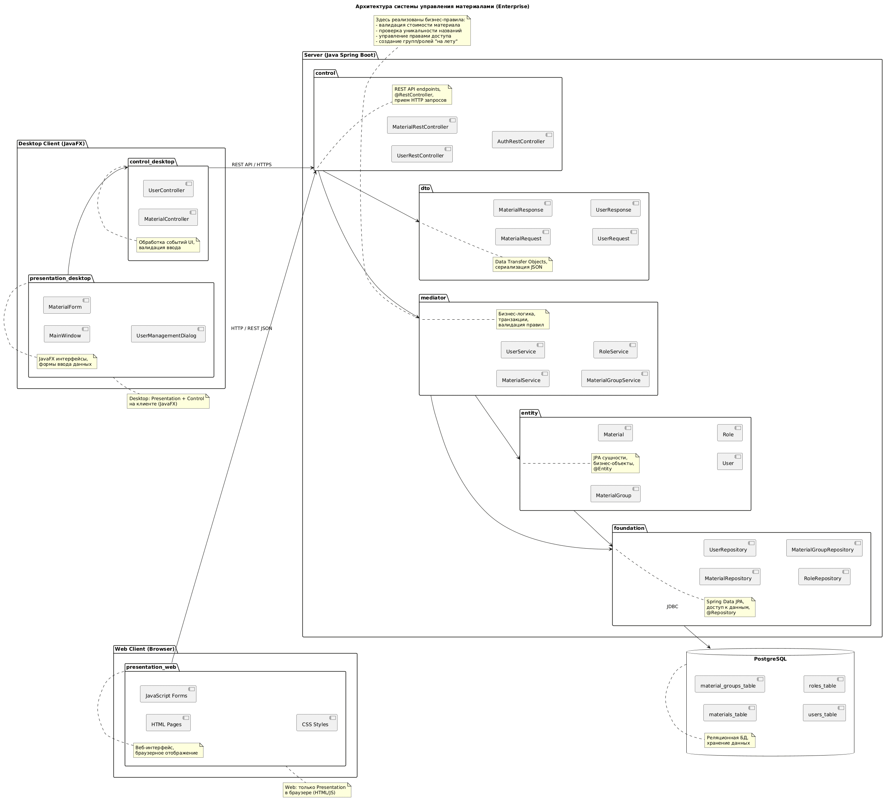
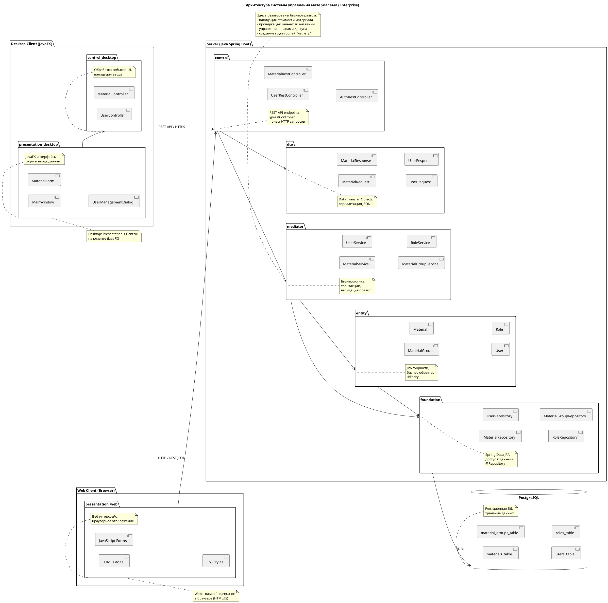

# PCMEF-диаграмма

## Описание

Для проекта выбрана **Enterprise-адаптация PCMEF** с поддержкой двух типов клиентов: Desktop (JavaFX) и Web (браузер). Бизнес-логика, доступ к данным и REST API централизованы на сервере (Java Spring Boot), а клиенты взаимодействуют с сервером исключительно через HTTPS/JSON.

Ключевые особенности адаптации:

- Presentation-слой разделён физически: Desktop-клиент содержит Presentation + Control на стороне клиента, Web-клиент содержит только Presentation в браузере.
- Control, Mediator, Entity, Foundation расположены централизованно на сервере.
- Единый REST API служит точкой интеграции для обоих типов клиентов.
- Слой DTO добавлен на сервере для сериализации данных между клиентами и сервером.

## Диаграмма

## Слои

| Слой | Расположение | Компоненты | Описание |
|---|---|---|---|
| Presentation (Desktop) | Desktop-клиент (JavaFX) | MainWindow, MaterialForm, UserManagementDialog | JavaFX-интерфейсы, формы ввода данных |
| Control (Desktop) | Desktop-клиент (JavaFX) | MaterialController, UserController | Обработка событий UI, валидация ввода |
| Presentation (Web) | Браузер | HTML Pages, JavaScript Forms, CSS Styles | Веб-интерфейс, браузерное отображение |
| Control (Server) | Сервер (Spring Boot) | MaterialRestController, UserRestController, AuthRestController | REST API endpoints, @RestController, приём HTTP-запросов |
| DTO | Сервер (Spring Boot) | MaterialRequest, MaterialResponse, UserRequest, UserResponse | Data Transfer Objects, сериализация JSON |
| Mediator | Сервер (Spring Boot) | MaterialService, UserService, MaterialGroupService, RoleService | Бизнес-логика, транзакции, валидация правил |
| Entity | Сервер (Spring Boot) | Material, MaterialGroup, User, Role | JPA-сущности, бизнес-объекты, @Entity |
| Foundation | Сервер (Spring Boot) | MaterialRepository, UserRepository, RoleRepository, MaterialGroupRepository | Spring Data JPA, доступ к данным, @Repository |
| Database | PostgreSQL | materials_table, material_groups_table, users_table, roles_table | Реляционная БД, хранение данных |

## Сравнение с классическим PCMEF

| Слой | Классический PCMEF (Desktop) | Enterprise (Desktop + Web) |
|---|---|---|
| Presentation | JavaFX/Swing в одном JVM | Desktop: JavaFX; Web: HTML/JS в браузере |
| Control | В том же JVM | Desktop: на клиенте; Web: на сервере (REST Controllers) |
| Mediator | В том же JVM | На сервере (@Service) |
| Entity | В том же JVM | На сервере (JPA @Entity) |
| Foundation | В том же JVM | На сервере (@Repository) + JDBC к PostgreSQL |
| Доп. слои | Отсутствуют | DTO для API, контракты интерфейсов |
| Связь | Прямые вызовы методов | REST API / HTTPS + JSON |

## Граф зависимостей (текстовое представление)

**Клиентская часть (Desktop):**
`MaterialForm → DesktopController → IMaterialService`

**Клиентская часть (Web):**
`Web Pages → MaterialRestController (HTTP/REST)`

**Серверная часть (Spring Boot):**
`MaterialRestController → MaterialService → Material`
`MaterialService → IMaterialRepository`
`MaterialRepository → PostgreSQL (JDBC)`
`Material → MaterialRepository (Ассоциация)`

**Реализация контрактов (слабая связанность):**
`MaterialService ..|> IMaterialService`
`MaterialRepository ..|> IMaterialRepository`

**Общий поток данных (сверху вниз):**
`Desktop/Web Клиент → Control → Mediator (Service) → Foundation (Repository) → Database`

## PlantUML: диаграмма пакетов

