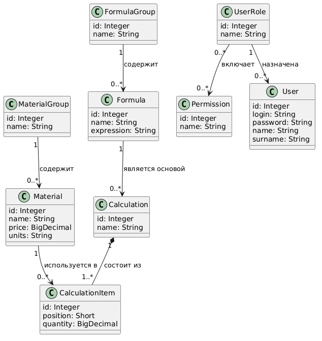
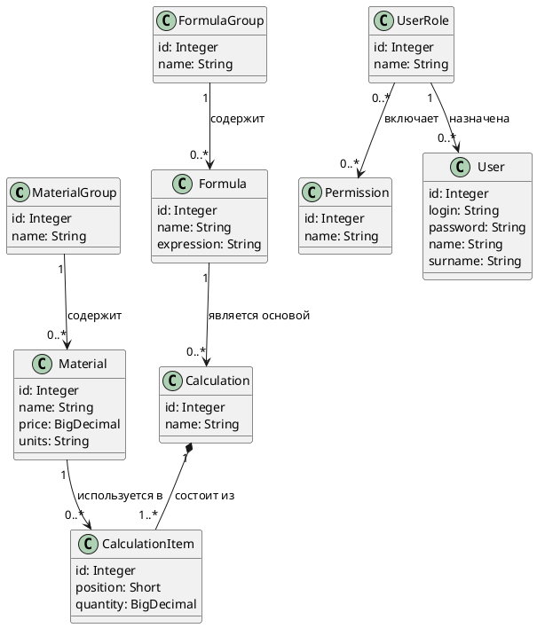

# Доменная модель

## Описание

Доменная модель описывает ключевые классы предметной области системы **SuperCalculator** и связи между ними.  

## Диаграмма

## Исходный код (PlantUML)

## Описание классов

| Класс | Описание |
|---|---|
| MaterialGroup | Группа для логической организации материалов |
| Material | Единица справочника с ценой; используется в позициях расчёта |
| FormulaGroup | Группа для логической организации формул |
| Formula | Математическое выражение с плейсхолдерами `{группа}` и `{const}` |
| Calculation | Экземпляр формулы, заполненный конкретными значениями; итог пересчитывается при каждом открытии |
| CalculationItem | Одна позиция расчёта: плейсхолдер → материал + количество |
| UserRole | Именованный набор прав доступа |
| Permission | Атомарное разрешение на действие в области системы |
| User | Субъект системы с логином, паролем и опциональной ролью |

## Связи

| Класс A | Мощность | Класс B | Тип | Описание |
|---|---|---|---|---|
| MaterialGroup | 1 | 0..* Material | Ассоциация | Группа содержит ноль или более материалов |
| FormulaGroup | 1 | 0..* Formula | Ассоциация | Группа содержит ноль или более формул |
| Formula | 1 | 0..* Calculation | Ассоциация | Формула является основой для расчётов; удаление формулы → каскадное удаление расчётов |
| Calculation | 1 | 1..* CalculationItem | Композиция | Расчёт состоит из одной или более позиций; удаление расчёта → удаление позиций |
| Material | 1 | 0..* CalculationItem | Ассоциация | Материал используется в позициях; удаление материала не удаляет позицию (расчёт становится невычислимым) |
| UserRole | 1 | 0..* User | Ассоциация | Роль назначена нулю или более пользователям |
| UserRole | 0..* | 0..* Permission | Ассоциация | Роль включает произвольный набор прав (через таблицу role_permissions) |
