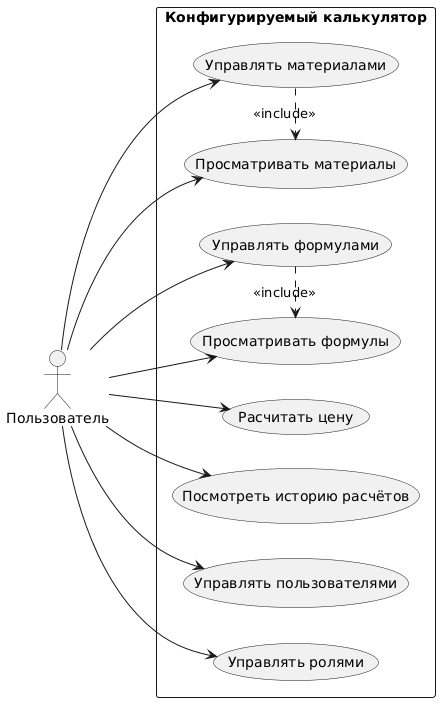
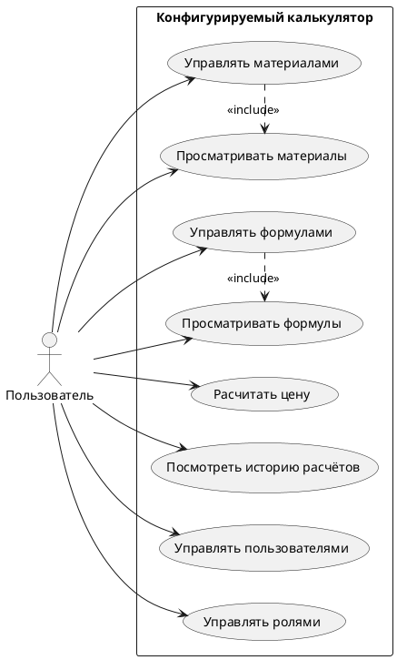

# Use Case диаграмма

## Описание

Use Case диаграмма описывает функциональные возможности системы **SuperCalculator** с точки зрения единственного актора — Пользователя. Все варианты использования расположены внутри границы системы «Конфигурируемый калькулятор».

## Диаграмма

## Исходный код (PlantUML)

## Акторы

| Актор | Описание |
|---|---|
| Пользователь | Любой авторизованный сотрудник компании. Доступные UC определяются назначенной ролью |

## Варианты использования

| ID | Название | Включает | Описание |
|---|---|---|---|
| UC-002 | Управлять пользователями | — | Создание и удаление учётных записей пользователей |
| UC-003 | Просматривать материалы | — | Просмотр справочника материалов с фильтрацией по группам |
| UC-004 | Управлять материалами | UC-003 | Создание, редактирование, удаление материалов и групп |
| UC-005 | Управлять формулами | UC-006 | Создание, редактирование, удаление формул и групп |
| UC-006 | Просматривать формулы | — | Просмотр справочника формул с фильтрацией по группам |
| UC-007 | Рассчитать цену | — | Создание расчёта на основе формулы, заполнение позиций, получение итоговой суммы |
| UC-008 | Посмотреть историю расчётов | — | Просмотр списка сохранённых расчётов и открытие любого из них |
| UC-009 | Управлять ролями | — | Создание и редактирование ролей с настраиваемым набором прав |

## Связи include

- **UC-004 → UC-003**: управление материалами всегда включает их просмотр (список отображается как часть той же страницы)
- **UC-005 → UC-006**: управление формулами всегда включает их просмотр (аналогично)
