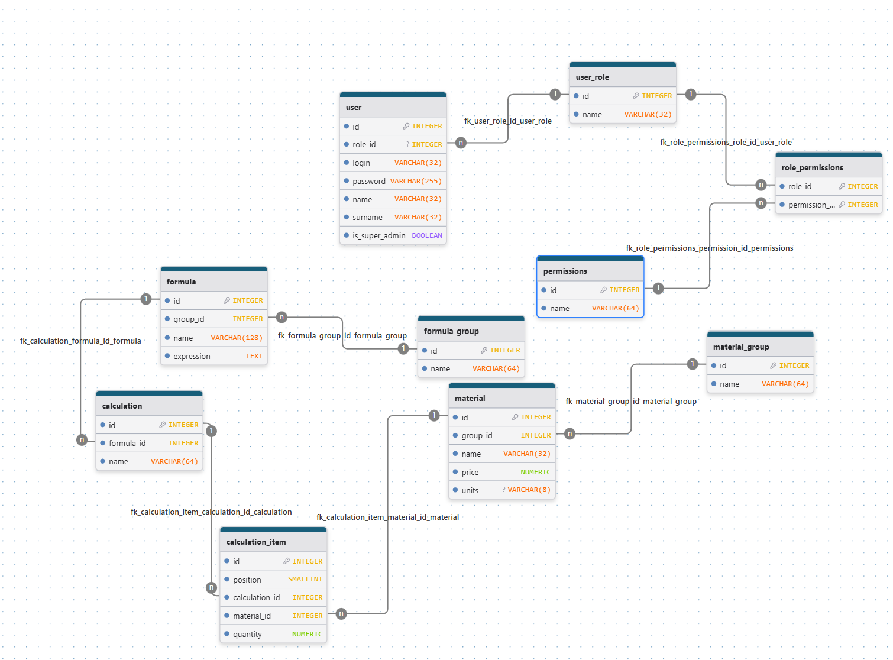
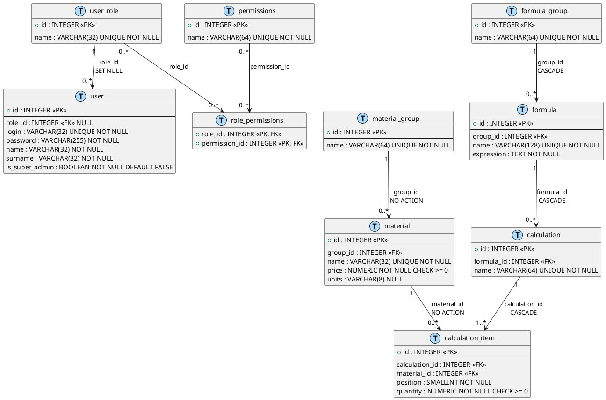

# ER-диаграмма

## Описание

ER-диаграмма описывает физическую схему базы данных системы **Calculator**. Схема состоит из 9 таблиц, объединённых в три логических блока: управление пользователями и правами, справочник материалов, формулы и расчёты.

## Диаграмма

## Таблицы

| Таблица | Описание |
|---|---|
| `user` | Пользователи системы: логин, пароль, имя, фамилия, опциональная роль и флаг супер-администратора |
| `user_role` | Справочник ролей пользователей |
| `permissions` | Атомарные права доступа (разрешения) |
| `role_permissions` | Связующая таблица M:N между ролями и правами |
| `material` | Единица справочника материалов: название, цена, единица измерения, группа |
| `material_group` | Группы для логической организации материалов |
| `formula` | Математическая формула с текстовым выражением (`expression`) и группой |
| `formula_group` | Группы для логической организации формул |
| `calculation` | Расчёт на основе формулы; содержит набор позиций из материалов |
| `calculation_item` | Позиция расчёта: ссылка на материал, количество и порядковый номер |

## Связи

| Таблица A | Мощность | Таблица B | Каскад | Описание |
|---|---|---|---|---|
| `user_role` | 1 | 0..* `user` | SET NULL при удалении роли | Роль назначена нулю или более пользователям |
| `user_role` | 0..* | 0..* `permissions` | NO ACTION | Роль имеет набор прав через `role_permissions` |
| `material_group` | 1 | 0..* `material` | NO ACTION | Группа содержит ноль или более материалов |
| `formula_group` | 1 | 0..* `formula` | CASCADE | Группа содержит ноль или более формул; удаление группы → удаление формул |
| `formula` | 1 | 0..* `calculation` | CASCADE | Формула является основой расчётов; удаление формулы → удаление расчётов |
| `calculation` | 1 | 1..* `calculation_item` | CASCADE | Расчёт состоит из позиций; удаление расчёта → удаление позиций |
| `material` | 1 | 0..* `calculation_item` | NO ACTION | Материал используется в позициях; удаление не затрагивает позиции |

## PlantUML: ER-диаграмма

## Ограничения целостности

| Таблица | Поле | Ограничение | Описание |
|---|---|---|---|
| `material` | `price` | `CHECK (price >= 0)` | Цена материала не может быть отрицательной |
| `calculation_item` | `quantity` | `CHECK (quantity >= 0)` | Количество в позиции не может быть отрицательным |
| `user` | `login` | `UNIQUE NOT NULL` | Логин уникален в системе |
| `user` | `is_super_admin` | `TRIGGER BEFORE DELETE` | Запрещает удаление строки, если флаг = TRUE |
| `user` | `is_super_admin` | `TRIGGER BEFORE UPDATE` | Запрещает сброс флага (TRUE → FALSE) |
| `material` | `name` | `UNIQUE NOT NULL` | Название материала уникально |
| `formula` | `name` | `UNIQUE NOT NULL` | Название формулы уникально |
| `calculation` | `name` | `UNIQUE NOT NULL` | Название расчёта уникально |
| `role_permissions` | `(role_id, permission_id)` | `PRIMARY KEY` | Составной PK исключает дубли прав в роли |

## Индексы

| Индекс | Таблица | Поля | Назначение |
|---|---|---|---|
| `formula_index_0` | `formula` | `group_id` | Ускорение выборки формул по группе |
| `calculation_index_0` | `calculation` | `formula_id` | Ускорение выборки расчётов по формуле |
| `calculation_item_index_0` | `calculation_item` | `(calculation_id, material_id)` | Ускорение JOIN при загрузке позиций расчёта |
| `material_index_0` | `material` | `group_id` | Ускорение выборки материалов по группе |
| `user_index_0` | `user` | `role_id` | Ускорение выборки пользователей по роли |
