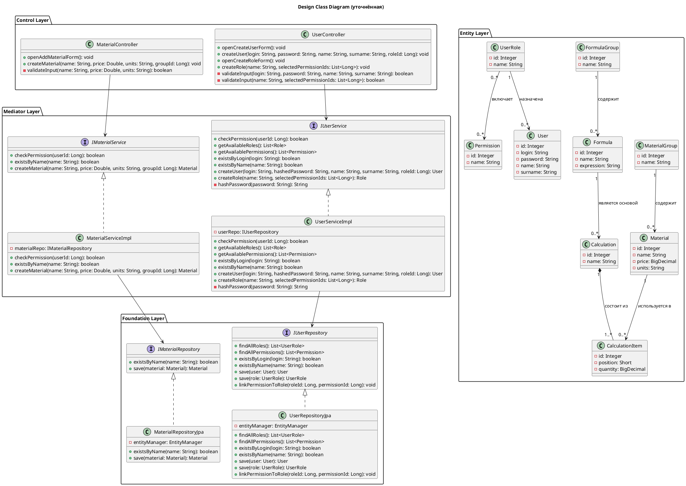

# Class Diagram

Уточнённая диаграмма классов проекта **Calculator**. По сравнению с исходной диаграммой: все классы разбиты по слоям PCMEF, добавлены интерфейсы сервисов и репозиториев, добавлены методы на основе анализа диаграмм последовательности, добавлены реализации Impl и Jpa, показаны зависимости между слоями.

[`images/class-diagram-refined.png`](images/class-diagram-refined.png)

---

## Слои архитектуры PCMEF

| Слой | Классы |
|------|--------|
| **Control** | `MaterialController`, `UserController` |
| **Mediator** | `IMaterialService`, `IUserService`, `MaterialServiceImpl`, `UserServiceImpl` |
| **Entity** | `Material`, `MaterialGroup`, `Formula`, `FormulaGroup`, `Calculation`, `CalculationItem`, `User`, `UserRole`, `Permission` |
| **Foundation** | `IMaterialRepository`, `IUserRepository`, `MaterialRepositoryJpa`, `UserRepositoryJpa` |

---

## PlantUML-код диаграммы



---

## Применяемые паттерны GoF

### Паттерн 1: Builder — построение расчёта

**Класс:** `Calculation.Builder`

**Обоснование:** `Calculation` — сложный объект, состоящий из имени, формулы и множества `CalculationItem`. Без Builder пришлось бы передавать всё сразу в конструктор, легко перепутать порядок параметров и неудобно добавлять items по одному.

**Улучшение архитектуры:** код создания объекта читаемый и пошаговый, легко добавлять новые параметры не ломая существующий код.

```java
public class Calculation {
    private Integer id;
    private String name;
    private Formula formula;
    private List<CalculationItem> items;

    private Calculation() {}

    public static class Builder {
        private String name;
        private Formula formula;
        private List<CalculationItem> items = new ArrayList<>();

        public Builder name(String name) {
            this.name = name;
            return this;
        }

        public Builder formula(Formula formula) {
            this.formula = formula;
            return this;
        }

        public Builder addItem(Material material, short position, BigDecimal quantity) {
            CalculationItem item = new CalculationItem();
            item.setMaterial(material);
            item.setPosition(position);
            item.setQuantity(quantity);
            this.items.add(item);
            return this;
        }

        public Calculation build() {
            Calculation calc = new Calculation();
            calc.name = this.name;
            calc.formula = this.formula;
            calc.items = this.items;
            return calc;
        }
    }
}

// Использование в сервисе
Calculation calc = new Calculation.Builder()
    .name("Расчёт стола")
    .formula(formula)
    .addItem(material1, (short)1, new BigDecimal("2.5"))
    .addItem(material2, (short)2, new BigDecimal("1.0"))
    .addItem(material3, (short)3, new BigDecimal("3.0"))
    .build();
```

---

### Паттерн 2: Proxy — проверка прав доступа

**Классы:** `MaterialServiceProxy`, `UserServiceProxy`

**Обоснование:** Без Proxy проверка прав дублируется в каждом контроллере. Если логика проверки изменится — придётся менять код во всех контроллерах. Proxy централизует проверку прав в одном месте.

**Улучшение архитектуры:** контроллеры остаются чистыми и отвечают только за UI, соблюдается принцип единственной ответственности.

```java
public class MaterialServiceProxy implements IMaterialService {
    private final MaterialServiceImpl realService;
    private final IUserService userService;
    private final Long userId;

    public MaterialServiceProxy(MaterialServiceImpl realService,
                                IUserService userService,
                                Long userId) {
        this.realService = realService;
        this.userService = userService;
        this.userId = userId;
    }

    @Override
    public Material createMaterial(String name, Double price,
                                   String units, Long groupId) {
        if (!userService.checkPermission(userId)) {
            throw new AccessDeniedException("Нет прав для создания материала");
        }
        return realService.createMaterial(name, price, units, groupId);
    }

    @Override
    public boolean existsByName(String name) {
        return realService.existsByName(name);
    }
}

// Контроллер чистый — не знает о правах доступа
public class MaterialController {
    private final IMaterialService materialService; // сюда подаётся Proxy

    public void createMaterial(String name, Double price,
                               String units, Long groupId) {
        materialService.createMaterial(name, price, units, groupId);
    }
}
```

---

### Паттерн 3: Decorator — логирование действий пользователя

**Класс:** `LoggingUserService`

**Обоснование:** В системе с разграничением прав доступа важно логировать кто, когда и что создавал. Decorator позволяет добавить логирование поверх существующего `UserServiceImpl` не изменяя его код.

**Улучшение архитектуры:** логирование отделено от бизнес-логики, `UserServiceImpl` остаётся чистым, можно легко добавить или убрать логирование не трогая основной код.

```java
public class LoggingUserService implements IUserService {
    private final IUserService wrapped;

    public LoggingUserService(IUserService wrapped) {
        this.wrapped = wrapped;
    }

    @Override
    public User createUser(String login, String hashedPassword,
                           String name, String surname, Long roleId) {
        System.out.println("[LOG] Создание пользователя: " + login
                + " в " + LocalDateTime.now());
        User user = wrapped.createUser(login, hashedPassword, name, surname, roleId);
        System.out.println("[LOG] Пользователь создан с id: " + user.getId());
        return user;
    }

    @Override
    public UserRole createRole(String name, List<Long> selectedPermissionIds) {
        System.out.println("[LOG] Создание роли: " + name
                + " в " + LocalDateTime.now());
        UserRole role = wrapped.createRole(name, selectedPermissionIds);
        System.out.println("[LOG] Роль создана с id: " + role.getId());
        return role;
    }
}

// Сборка цепочки декораторов
IUserService userService = new LoggingUserService(new UserServiceImpl(userRepo));
```
