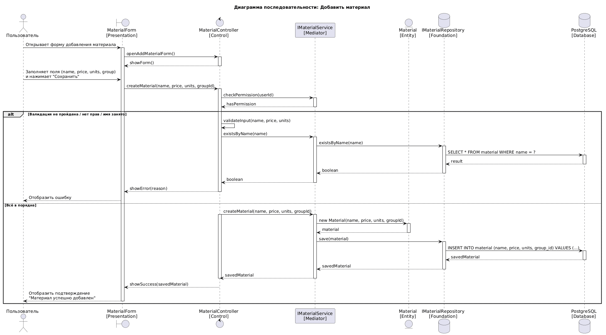
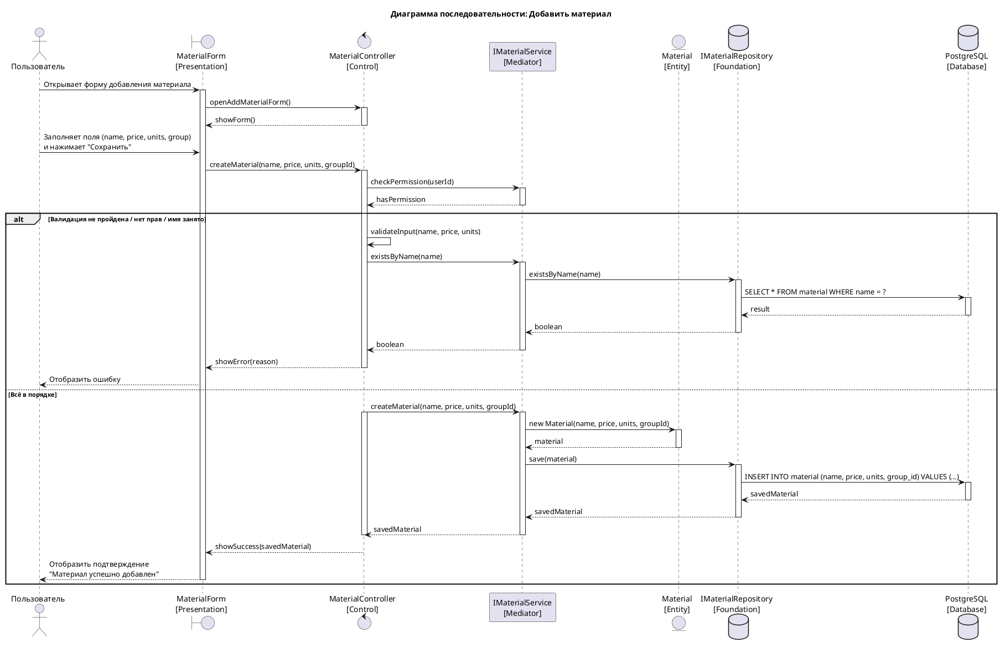
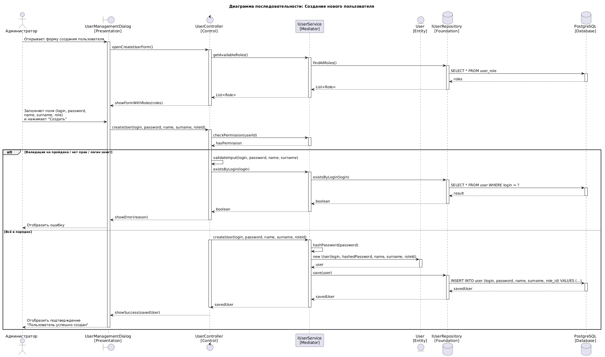
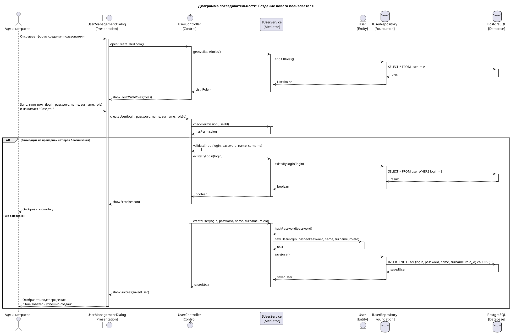
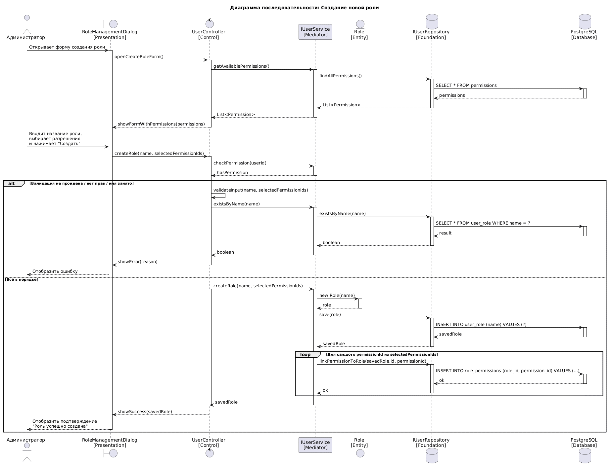
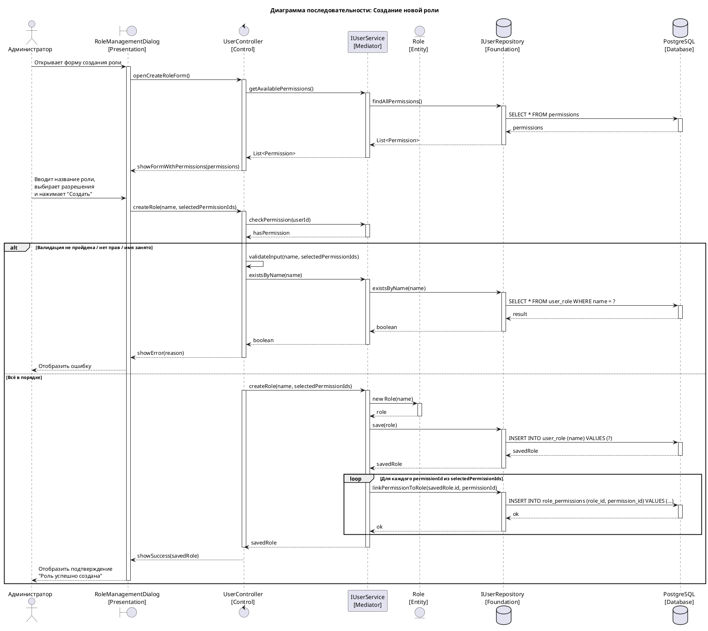

# Sequence Diagrams

Диаграммы последовательности для ключевых сценариев использования проекта **SuperCalculator** — конфигурируемого калькулятора для автоматизации ценообразования. Архитектура соответствует слоям PCMEF: Presentation → Control → Mediator → Entity → Foundation → Database.

---

## UC-1: Добавить материал

Пользователь создаёт новый материал, заполняя данные о нём. После этого материал можно использовать для расчёта стоимости товара.

---

## UC-2: Создать нового пользователя

Пользователь с соответствующими правами доступа может регистрировать новых пользователей в системе.

---

## UC-3: Создать новую роль

Пользователь с соответствующими правами доступа может создавать новые роли, чтобы назначать на них других пользователей.

