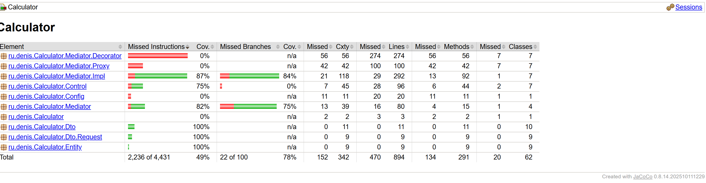

# Тесты

## Инструменты

| Инструмент | Назначение |
|---|---|
| JUnit 5 (Jupiter) | Фреймворк тестирования |
| Mockito | Моки и стабы зависимостей |
| Spring MockMvc (standalone) | Тестирование REST-контроллеров без поднятия сервера |
| AssertJ | Fluent-утверждения |
| JaCoCo | Отчёт о покрытии кода |

Все зависимости поставляются через `spring-boot-starter-test` + `spring-security-test` + `spring-boot-starter-testcontainers`. JaCoCo сконфигурирован в `build.gradle.kts` и генерирует HTML-отчёт автоматически после каждого прогона тестов (`finalizedBy(tasks.jacocoTestReport)`).

## Результаты

**157 тестов, 0 failures, покрытие 49% (instruction coverage, JaCoCo).**

## Запуск

```bash
# из корня CalculatorBack
./gradlew test
```

- Результаты: `build/reports/tests/test/index.html`
- JaCoCo: `build/reports/jacoco/test/html/index.html`

---

## Unit-тесты сервисов — 96 тестов

Расположены в `src/test/.../Mediator/`. Используют `@ExtendWith(MockitoExtension.class)` — все репозитории замоканы, Spring-контекст и база данных не задействованы.

| Тест-класс | Покрываемый класс | Тестов |
|---|---|---|
| `FormulaEvaluatorTest` | `FormulaEvaluator` | 18 |
| `MaterialServiceImplTest` | `MaterialServiceImpl` | 15 |
| `MaterialGroupServiceImplTest` | `MaterialGroupServiceImpl` | 15 |
| `UserServiceImplTest` | `UserServiceImpl` | 14 |
| `CalculationServiceImplTest` | `CalculationServiceImpl` | 14 |
| `FormulaServiceImplTest` | `FormulaServiceImpl` | 11 |
| `FormulaGroupServiceImplTest` | `FormulaGroupServiceImpl` | 9 |

### FormulaEvaluatorTest (18 тестов)

Тестирует ключевой алгоритмический компонент — рекурсивный нисходящий парсер арифметических выражений.

| Группа | Что проверяется |
|---|---|
| `extractPlaceholders` | нет плейсхолдеров → `[]`; `{const}` → `["const"]`; `{material}` → `["material"]`; несколько смешанных → в порядке появления |
| `evaluate` — чистая арифметика | сложение, вычитание, умножение, деление, скобки, приоритет операторов, отрицательные числа |
| `evaluate` — `{const}` | подставляет `quantity`; два `{const}` → берёт элементы по порядку |
| `evaluate` — `{material}` | подставляет `price × quantity`; `material == null` → `Optional.empty()` |
| Граничные случаи | меньше items чем плейсхолдеров → `empty`; невалидное выражение → `empty`; нет плейсхолдеров → вычисляет как есть |

### CalculationServiceImplTest (14 тестов)

Использует `@Spy FormulaEvaluator` — реальная реализация вычислителя, а не мок. Это позволяет проверить сквозное поведение сервиса вместе с парсером.

Покрываются: `getAllCalculations`, `getCalculationById`, `createCalculation` (без items, с `{const}`, формула не найдена), `editCalculation` (удаление старых items, формула/расчёт не найдены), `deleteCalculation`, маппинг DTO при null-items и null-material.

### FormulaServiceImplTest (11 тестов)

Покрываются все CRUD-операции: happy-path с проверкой маппинга полей DTO и сценарии «не найдено» для формулы и группы.

### MaterialServiceImplTest / MaterialGroupServiceImplTest / UserServiceImplTest / FormulaGroupServiceImplTest

Аналогичная структура: CRUD happy-path + сценарии «не найдено». `MaterialGroupServiceImplTest` дополнительно проверяет все три стратегии удаления (`DeleteGroupStrategy`: CASCADE, DEFAULT, MOVE).

---

## Интеграционный тест — 3 теста

`PostgresSpringBootIntegrationTest` — единственный тест с реальным Spring-контекстом и реальной БД.

**Стек:** `@SpringBootTest(webEnvironment = RANDOM_PORT)` + Testcontainers (`postgres:16.3`). `@DynamicPropertySource` подставляет JDBC URL контейнера в конфигурацию. `@Transactional` — данные откатываются после каждого теста.

**Условный запуск:** кастомное расширение `DockerAvailableCondition` пропускает тесты если Docker недоступен — `./gradlew test` не падает на машинах без Docker.

| Тест | Что проверяет |
|---|---|
| `contextLoads` | Spring-контекст поднимается, репозитории инжектируются |
| `saveMaterialWithGroupAndQueryByName` | сохранение материала с группой; `findByGroup`, `findByNameContainingIgnoreCase` |
| `saveMultipleMaterialsAndSearchByGroupAndName` | `findByGroupAndNameContainingIgnoreCase` возвращает только совпадающие записи |

---

## Тесты контроллеров — 58 тестов

Расположены в `src/test/.../Control/`. Используют `MockMvcBuilders.standaloneSetup(controller)` — контроллер создаётся с замоканными сервисами, без полного Spring-контекста.

> `@WebMvcTest` удалён в Spring Boot 4.x, поэтому применяется standalone MockMvc. Spring Security фильтр-цепочка в standalone не активна — авторизация в этих тестах не проверяется. Тесты ошибочных сценариев используют `assertThatThrownBy(...).hasRootCauseMessage(...)`, так как standalone MockMvc пробрасывает `RuntimeException` как `ServletException`.

| Тест-класс | Тестов | Что проверяет |
|---|---|---|
| `UserControllerTest` | 14 | CRUD пользователей и ролей, защита super admin, эндпоинт `/permissions` |
| `MaterialControllerTest` | 16 | CRUD материалов и групп, фильтры `?groupId` и `?search`, стратегии удаления групп (CASCADE/MOVE) |
| `FormulaControllerTest` | 13 | CRUD формул и групп формул |
| `CalculationControllerTest` | 11 | CRUD расчётов, парсинг вложенных `items` в теле запроса |
| `AuthControllerTest` | 4 | login (200 + токен), login bad credentials, login без тела → 400, logout → 204 |

---

## Покрытие кода (JaCoCo)



**49% покрытие** по всему проекту. Это ожидаемый результат для архитектуры с Proxy и Decorator: классы-обёртки (`*ServiceProxy`, `*ServiceDecorator`) содержат код, который не тестируется напрямую в unit-тестах (они тестируют только `*ServiceImpl`).

Хорошо покрыты: `FormulaEvaluator` (все ветви), все `*ServiceImpl` (happy-path + error cases), все контроллеры (основные маршруты и коды ответов).

Не покрыты напрямую: `*ServiceProxy`, `*ServiceDecorator`, `SecurityConfig`, `UserDetailsServiceImpl`, `JwtService` — для них потребовались бы интеграционные тесты с поднятым Spring-контекстом.
