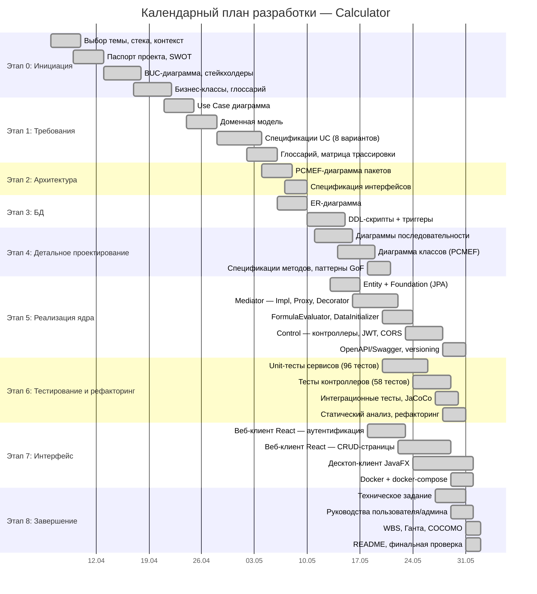

# Диаграмма Ганта
## Проект Calculator

---

---

## Сводная таблица этапов

| Этап | Название | Начало | Конец | Длительность |
|---|---|---|---|---|
| 0 | Инициация и бизнес-анализ | 06.04.2026 | 21.04.2026 | 16 дней |
| 1 | Проектирование требований | 21.04.2026 | 05.05.2026 | 15 дней |
| 2 | Архитектурное проектирование | 04.05.2026 | 10.05.2026 | 7 дней |
| 3 | Проектирование БД | 06.05.2026 | 15.05.2026 | 9 дней |
| 4 | Детальное проектирование | 11.05.2026 | 21.05.2026 | 10 дней |
| 5 | Реализация ядра | 13.05.2026 | 30.05.2026 | 18 дней |
| 6 | Тестирование и рефакторинг | 20.05.2026 | 30.05.2026 | 11 дней |
| 7 | Интерфейс и развёртывание | 18.05.2026 | 01.06.2026 | 14 дней |
| 8 | Завершение | 27.05.2026 | 01.06.2026 | 6 дней |
| | **Всего (с параллелизмом)** | **06.04.2026** | **01.06.2026** | **~8 недель** |
